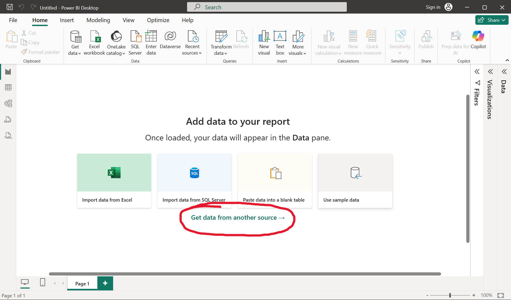
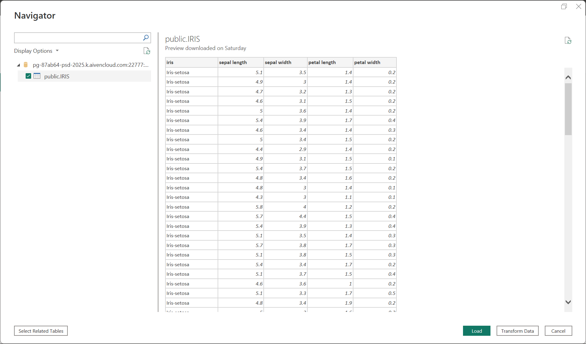
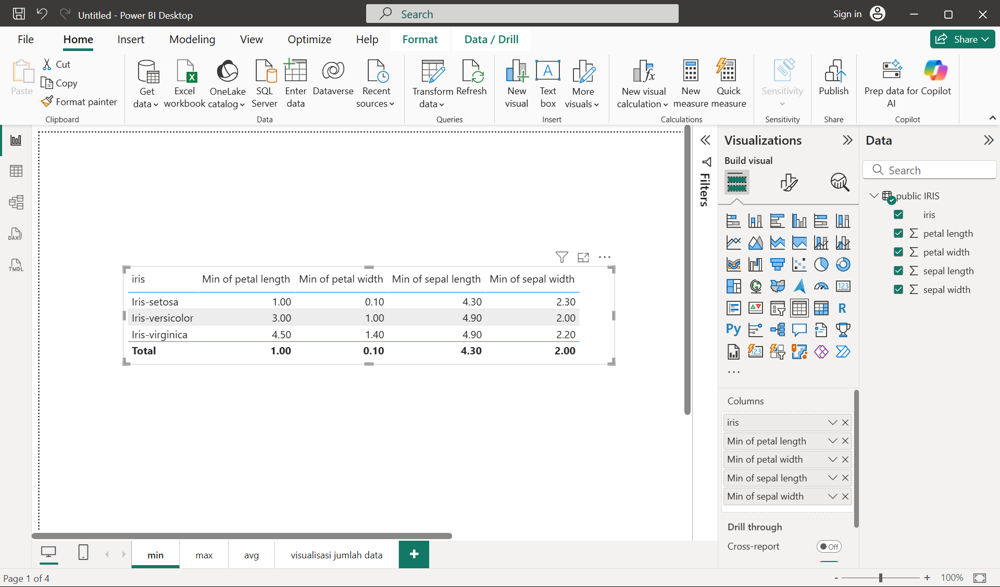
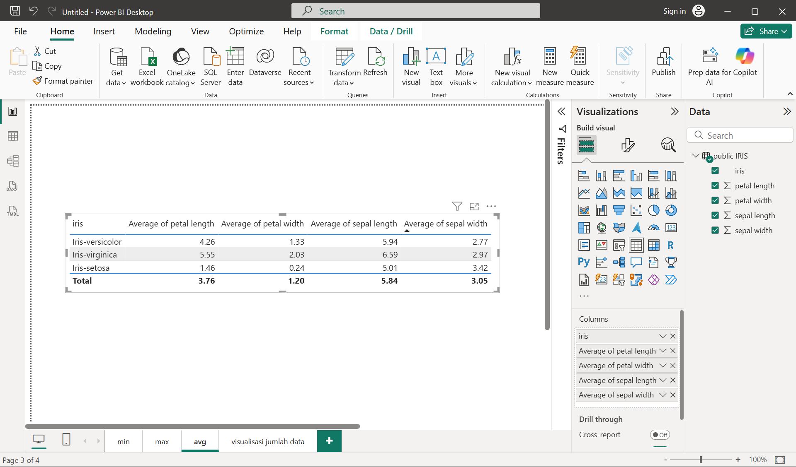
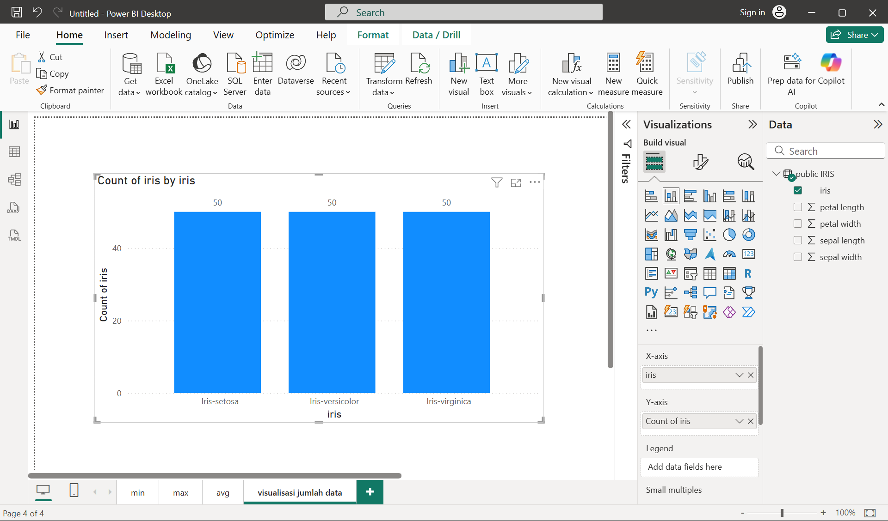
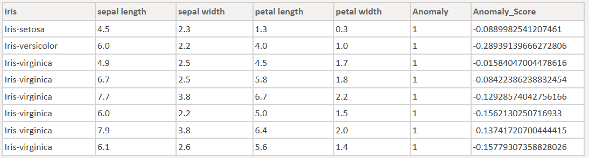
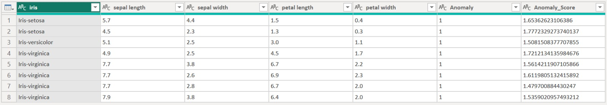

# Data Understanding

Dalam framework `CRISP-DM` (Cross-Industry Standard Process for Data Mining), tahap **Data Understanding** adalah langkah awal setelah perumusan masalah bisnis (Business Understanding). Fokus utamanya adalah mengenali, mengumpulkan, dan memahami data yang tersedia agar sesuai dengan tujuan analisis.

Kegiatannya mencakup:

1. **Pengumpulan data awal** dari berbagai sumber.
2. **Deskripsi data**, misalnya ukuran, format, dan atribut.
3. **Eksplorasi data**, seperti distribusi nilai, pola, dan hubungan antar-variabel.
4. **Verifikasi kualitas data**, termasuk mendeteksi data hilang, duplikasi, atau anomali.

## Pengumpulan Data Awal

Sebagai pembelajaran, dataset yang akan digunakan adalah [**Iris Flower Dataset**](https://www.kaggle.com/datasets/arshid/iris-flower-dataset?select=IRIS.csv) yang bersumber dari website kaggle.

## Deskripsi Data

Dataset yang digunakan terdiri dari 4 feature bertipe numerik dan target bertipe categorikal dengan 3 class. Dataset ini berisi 150 baris data atau instance. Berikut detail kolom pada dataset:

**`Feature`:**
**sepal length, sepal width, petal length, petal width**

**`Label/Target`:**
**iris** (Iris-setosa, Iris-versicolor, Iris-virginica)

## **Eksplorasi Data**

Eksplorasi data pada bahasan ini akan mencakup pencarian `min max`, `rata-rata` dari setiap kolom, dan visualisasi jumlah setiap kelas menggunakan grafik batang.

Eksplorasi data akan dilakukan menggunakan bantuan software `Power BI`. Namun import data tidak akan langsung menggunakan file excel atau csv melainkan menggunakan sql database. Database Management System (DBMS) yang akan digunakan adalah postgresql dan mysql. Berikut adalah langkah-langkap eksplorasi data menggunakan Power BI:

### **Import Data**

**1.** Import data CSV **Iris Flower Dataset** yang telah didapat dari kaggle ke dalam MySQL dan PostgreSQL.

**2. Koneksikan Database dengan Power BI**. Buka Power BI dan klik **"get data from another source"** seperti gambar di bawah.


**3.** Pilih Menu `Database` kemudian pilih `MySQL database` atau `PostgreSQL database`. Di sini saya akan mencontohkan menggunakan PostgreSQL. Kemudian klik connect.

**4.** Masukkan informasi server diikuti port dan database tempat menyimpan dataset, kemudian klik OK. Sebagai contoh perhatikan gambar berikut:


**5.** Pilih tabel dataset yang telah diimport. Kemudian klik load seperti gambar berikut:


---

### **Min Data**

Setelah dilakukan visualisasi data minimum untuk setiap feature, didapatkanlah hasil seperti pada gambar di bawah ini.

Berdasarkan gambar tersebut, berikut adalah nilai minimum untuk setiap feature:

- **`Petal Length`: 1.00**
- **`Petal Width`: 0.10**
- **`Sepal Length`: 4.30**
- **`Sepal Width`: 2.00**

### **Max Data**

Untuk data maximum, didapatkan hasil seperti pada gambar di bawah ini.

Berdasarkan gambar tersebut, berikut adalah nilai maximum untuk setiap feature:

- **`Petal Length`: 6.90**
- **`Petal Width`: 2.50**
- **`Sepal Length`: 7.90**
- **`Sepal Width`: 4.40**

### **Average Data**

Hasil data rata-rata untuk setiap feature didapat seperti gambar berikut.

Berdasarkan gambar tersebut, berikut adalah nilai rata-rata untuk setiap feature:

- **`Petal Length`: 3.76**
- **`Petal Width`: 1.20**
- **`Sepal Length`: 5.84**
- **`Sepal Width`: 3.05**

### **Visualisasi Jumlah Data**

Berikut adalah grafik jumlah setiap class iris dalam dataset.

Dari gambar tersebut, bisa dilihat bahwa jumlah setiap kelas sama rata, yaitu berjumlah 50 atau bisa dibilang distribusi datanya merata.

### **Deteksi outliers**

Deteksi outliers pada dataset akan menggunakan bantuan metod `ABOD`, `KNN`, `LOF` menggunakan library python `pycaret`. Berikut kode python yang digunakan untuk menggunakan model-model dalam pycaret untuk deteksi anomali sebagai contoh menggunakan model `ABOD`:

```
import pandas as pd
from pycaret.anomaly import *

model = 'abod'

data = dataset.copy()
abod_data = setup(data, session_id=123)
abod = create_model(model)
abod_predictions = assign_model(abod)

data_anomaly = abod_predictions[abod_predictions['Anomaly'] == 1]
data_anomaly
```

#### **ABOD**

Dari hasil deteksi anomali/outliers menggunakan `ABOD` didapat hasil data anomali sebagai berikut:


#### **KNN**

Berikut adalah hasil data outliers menggunakan metod `KNN`:

")

#### **LOF**

Berikut adalah hasil data outliers menggunakan metod `LOF`:

")

Dapat dilihat dari ketiga hasil deteksi anomaly menggunakan 3 model yang berbeda. Ketiga model mendeteksi beberapa data yang sama sebagai data anomali. Namun ada juga data berbeda antar model satu dengan yang lain yang dianggap sebagai data anomali. Hal ini menunjukkan perbedaan cara model satu dengan yang lain dalam mendeteksi anomaly.
