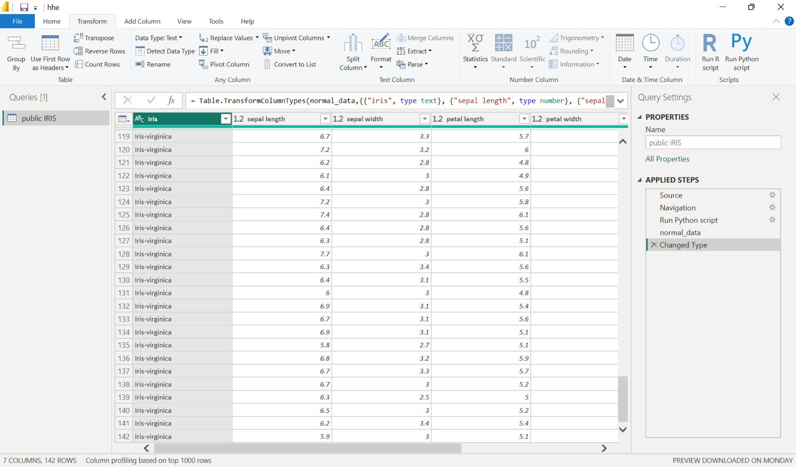

# Pre-Processing

Pre-processing dalam CRISP-DM adalah tahap persiapan data sebelum dianalisis, di mana data yang masih mentah dibersihkan, diubah, dan disesuaikan agar siap digunakan dalam pemodelan. Proses ini biasanya mencakup langkah-langkah seperti menghapus data yang tidak lengkap atau salah, mengatasi nilai yang hilang, menyatukan data dari berbagai sumber, mengubah format data agar konsisten, hingga melakukan normalisasi atau standarisasi nilai. Intinya, pre-processing berfungsi untuk memastikan kualitas data agar hasil analisis dan pemodelan menjadi lebih akurat, relevan, dan mudah diinterpretasikan.

Berdasarkan eksplorasi data yang sudah dilakukan pada tahapan data understanding menggunakan 3 model deteksi anomaly berbeda yaitu `abod`, `knn`, dan `lof`. Masing-masing model memprediksi 8 buah data anomali. Pada tahap pre-processing, data tersebut perlu dibersihkan dari dataset agar hasil prediksi model nantinya bisa lebih akurat. Untuk menghilangkan data anomaly, kita perlu memfilter data anomaly tersebut sebagai pengecualian untuk digunakan sebagai dataset. Berikut adalah script python yang digunakan untuk memfilter data anomaly:

```
import pandas as pd
from pycaret.anomaly import *

data = dataset.copy()
abod_data = setup(data, session_id=123)
abod = create_model('abod')
abod_predictions = assign_model(abod)

data_anomaly = abod_predictions[abod_predictions['Anomaly'] == 1]
data_anomaly

normal_data = abod_predictions[abod_predictions['Anomaly'] == 0]
normal_data
```

Varibel `normal_data` digunakan untuk menyimpan data yang sudah bersih dari. Berikut adalah dataset baru yang sudah dibersihkan dari data anomaly:

